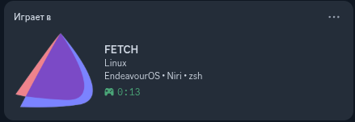
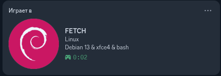

# discord-fetch

[ENG] Like `fastfetch`, but for your Discord status. Lightweight, fast, and fully customizable via TOML.
[RU] Как `fastfetch`, но для твоего статуса в Дискорде. Легковесный, быстрый и полностью настраиваемый через TOML.

---

##  Preview / Примеры

| Fedora Workstation | EndeavourOS (Default) | Debian Stable |
| :---: | :---: | :---: |
|  |  |  |

---

## [ENG]

`discord-fetch` is a modern CLI utility written in Rust. It automatically gathers information about your OS, Desktop Environment, and Shell, and displays it as your Discord activity. 

###  How to Build & Run
1. Make sure you have the[Rust toolchain installed](https://rust-lang.org/).
2. Clone the repository and build the release binary:
   ```bash
   git clone https://github.com/Sholk-linux/discord-fetch
   cd discord-fetch
   cargo build --release
   ```
3. Run the compiled binary:
   ```bash
   ./target/release/discord-fetch
   ```

###  How to get App ID and upload Logos
1. Go to the [Discord Developer Portal](https://discord.com/developers/applications) and click **New Application**. The name you choose will be displayed as `Playing to <Name>`.
2. Copy the **Application ID** (Client ID) from the *General Information* tab and paste it into your `config.toml`.
3. Go to the **Rich Presence -> Art Assets** tab and upload your square logo (e.g., your OS or terminal icon).
4.  **Important:** It is recommended to name your uploaded image asset **`logo`**. If you name it something else, make sure to specify that exact name in your `config.toml` under the `large_image` key.

###  Configuration File Path
On the very first launch, the utility will safely generate a template config file and exit. You can find it at:
- **Linux/Unix**: `~/.config/discord-fetch/config.toml`
- **Windows**: `AppData\Roaming\discord-fetch\config.toml`

For a complete breakdown of all config options, parameters, and manual overrides, please see the [Detailed Documentation File](DOCUMENTATION.md).

---

## [RU]

`discord-fetch` — это современная, CLI-утилита, написанная на Rust. Она автоматически собирает информацию о вашей операционной системе, графическом окружении (DE) и активном шелле, после чего выводит эти данные в ваш статус Discord.

###  Как собрать и запустить
1. Убедитесь, что у вас установлен [Rust](https://rust-lang.org/).
2. Склонируйте репозиторий и скомпилируйте релизную версию:
   ```bash
   git clone https://github.com/Sholk-linux/discord-fetch
   cd discord-fetch
   cargo build --release
   ```
3. Запустите готовый бинарник:
   ```bash
   ./target/release/discord-fetch
   ```

###  Как получить App ID и загрузить логотипы
1. Перейдите на [Discord Developer Portal](https://discord.com/developers/applications) и нажмите **New Application**. Имя приложения — это то, что будет написано после слов *«Играет в...»*.
2. Скопируйте **Application ID** со вкладки *General Information* и вставьте его в свой `config.toml`.
3. Перейдите во вкладку **Rich Presence -> Art Assets** и загрузите квадратный логотип (например, иконку вашей ОС).
4.  **Важно:** Рекомендуется назвать загруженную картинку словом **`logo`**. Если вы назовёте её как-то иначе, обязательно укажите это точное имя в вашем файле `config.toml` в поле `large_image`.

###  Где искать файл конфигурации
При самом первом запуске утилита автоматически создаст шаблон конфигурационного файла и завершит работу. Файл будет находиться по пути:
- **Linux/Unix**: `~/.config/discord-fetch/config.toml`
- **Windows**: `AppData\Roaming\discord-fetch\config.toml`

Полный разбор всех доступных настроек, параметров кастомизации вынесен в отдельный [Файл документации](DOCUMENTATION.md).

---
##  License
This project is licensed under the **GNU General Public License v3.0 (GPL-3.0)**.

